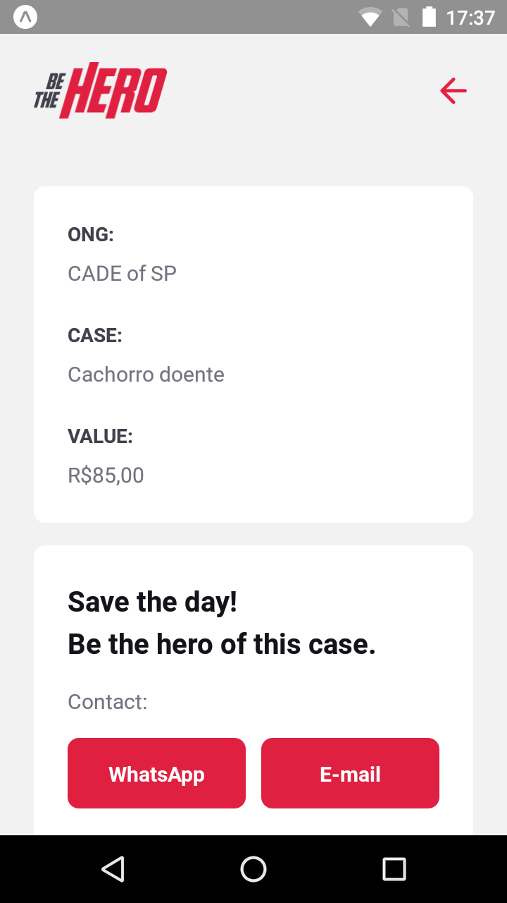

# Be The Hero

> Be The Hero is a project builds from the OmniStack Week launched by Rocketseat Company, with the objective to introduce concepts of a javascript FullStack development with practicality

#### Be The Hero allows Charities to find people interested in helping with their financial problems.

#### Main Platforms and Frameworks used:
- NodeJS
- React-Naive
- ReactJS
#### Other Frameworks and Tecnologies:
- Express
- Expo
- Knex
- Jest
- Celebrate/Joi
